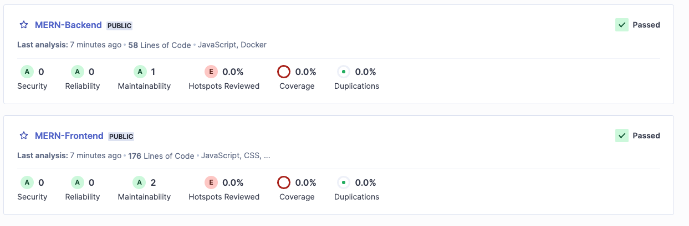
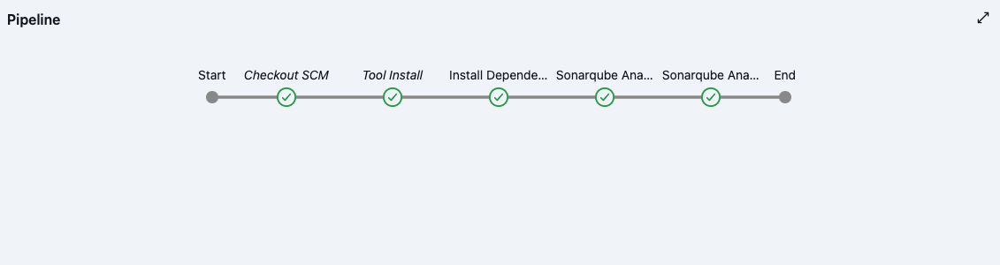
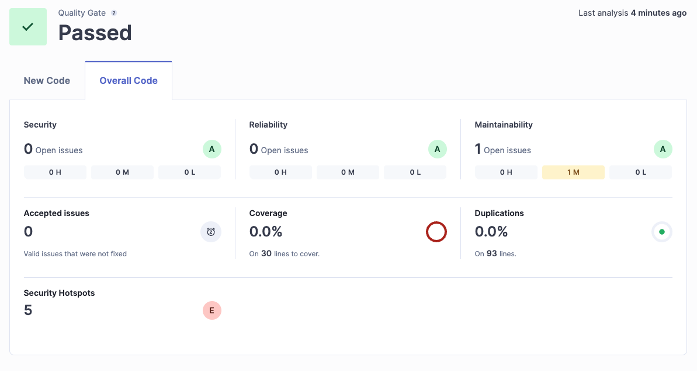
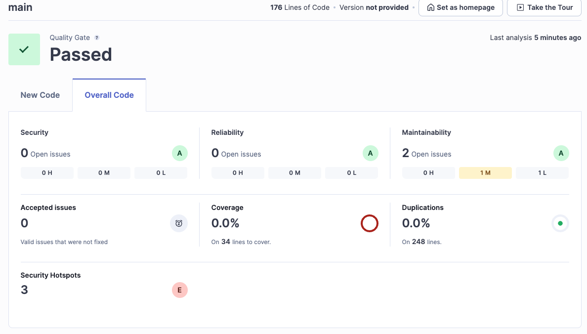
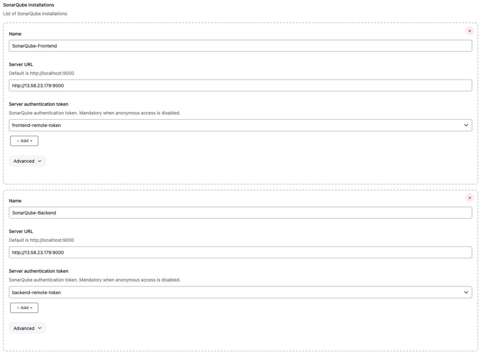

# MERN Stack Project with Jenkins and SonarQube Integration

## Project Overview

This project demonstrates a **MERN stack** (MongoDB, Express, React, Node.js) application integrated with **Jenkins** for CI/CD and **SonarQube** for static code analysis. The project includes:
- Backend API built with **Node.js** and **Express**.
- Frontend built with **React**.
- Automated builds, tests, and code quality checks using **Jenkins** and **SonarQube**.

## Key Features
- **CI/CD Pipeline**: Automated with Jenkins for both frontend and backend builds, tests, and deployments.
- **Static Code Analysis**: SonarQube integrated for JavaScript/Node.js code quality checks, including detection of bugs, vulnerabilities, and code smells.
- **Separate Frontend & Backend**: The frontend and backend have separate `package.json` files and are analyzed independently in SonarQube.
- **Quality Gates**: Enforces quality gates based on code coverage and code quality rules.

---

## Architecture

The application uses a two-server architecture:

- **Server 1**: Jenkins CI/CD server responsible for running pipelines, managing builds, and triggering SonarQube analysis.
- **Server 2**: SonarQube server for code quality analysis, reporting on bugs, vulnerabilities, and code coverage.

---

## Prerequisites

1. **Node.js** (v16 or higher)
2. **Docker** (for containerized SonarQube)
3. **Jenkins** (installed on a dedicated server)
4. **SonarQube** (installed on a separate server)

---

## Project Structure

```
.
├── README.md
├── Jenkinsfile
├── backend
│   ├── Dockerfile
│   ├── models
│   ├── package-lock.json
│   ├── package.json
│   ├── routes
│   └── server.js
├── docker-compose.yml
└── frontend
    ├── Dockerfile
    ├── package-lock.json
    ├── package.json
    ├── public
    ├── src
```

---

## Jenkins Pipeline Configuration

The **Jenkinsfile** for the project defines the following stages:
1. **Install Dependencies**: Installs necessary dependencies for both frontend and backend.
2. **SonarQube Analysis (Frontend)**: Runs static code analysis on the frontend using SonarQube.
3. **SonarQube Analysis (Backend)**: Runs static code analysis on the backend using SonarQube.
4. **Quality Gate Check**: Ensures the code meets the quality standards defined in SonarQube.

### Jenkinsfile:

```groovy
pipeline {
    agent any
    tools {
        nodejs "NodeJS"  // Ensure NodeJS is installed
    }
    environment {
        FRONTEND_SONAR_KEY = 'MERN-Frontend'
        BACKEND_SONAR_KEY = 'MERN-Backend'
    }
    stages {
        stage ('Install Dependencies') {
            steps {
                dir ('frontend') {
                    sh 'npm install'
                }
                dir ('backend') {
                    sh 'npm install'
                }
            }
        }
        stage ('SonarQube Analysis (Frontend)') {
            environment {
                scannerHome = tool 'SonarQube-Javascript'
            }
            steps {
                dir('frontend') {
                    withSonarQubeEnv('SonarQube-Frontend') {
                        sh '''
                        ${scannerHome}/bin/sonar-scanner \
                          -Dsonar.projectKey=$FRONTEND_SONAR_KEY \
                          -Dsonar.sources=. \
                          -Dsonar.javascript.lcov.reportPaths=coverage/lcov.info
                        '''
                    }
                }
            }
        }
        stage ('SonarQube Analysis (Backend)') {
            environment {
                scannerHome = tool 'SonarQube-Javascript'
            }
            steps {
                dir('backend') {
                    withSonarQubeEnv('SonarQube-Backend') {
                        sh '''
                        ${scannerHome}/bin/sonar-scanner \
                          -Dsonar.projectKey=$BACKEND_SONAR_KEY \
                          -Dsonar.sources=. \
                          -Dsonar.javascript.lcov.reportPaths=coverage/lcov.info
                        '''
                    }
                }
            }
        }
    }
}
```

---

## Running the Application

### Frontend:
1. Navigate to the `frontend` directory:
    ```bash
    cd frontend
    npm install
    npm start
    ```

### Backend:
1. Navigate to the `backend` directory:
    ```bash
    cd backend
    npm install
    npm run dev
    ```

---

## SonarQube Setup

1. **SonarQube Installation**:
   - Install SonarQube on a separate server using Docker:
     ```bash
     docker run -d --name sonarqube -p 9000:9000 sonarqube
     ```

2. **Project Configuration**:
   - Create two projects in SonarQube, one for the frontend (`MERN-Frontend`) and one for the backend (`MERN-Backend`).
   - Generate tokens for each project and configure them in Jenkins.

---

## Quality Gates

This project uses **SonarQube Quality Gates** to enforce the following criteria:
- Minimum **80% code coverage**.
- No **critical bugs or vulnerabilities**.
- Maximum of 5 **code smells** allowed per module.

---

## Screenshots

### Suggested Screenshots for Documentation:

1. **SonarQube Dashboard**:
<br/>

2. **Jenkins Pipeline**:
<br/>


3. **SonarQube Quality Gate**:
<br/>
<br/>


4. **Jenkins Configuration**:
<br/>


